## ϵ-贪心算法

ϵ-贪心算法可以分为两种

- 固定ϵ的ϵ-贪心算法
- 变化ϵ的ϵ-贪心算法

### 固定ϵ的ϵ-贪心算法

对于固定ϵ的ϵ-贪心算法非常得不稳定，书中具体的实现方法是

```python
np.random.seed(1)  # 设定随机种子,使实验具有可重复性
K = 10
bandit_10_arm = BernoulliBandit(K)

np.random.seed(1)
epsilon_greedy_solver = EpsilonGreedy(bandit_10_arm, epsilon=0.01)
epsilon_greedy_solver.run(5000)
plot_results([epsilon_greedy_solver], ["EpsilonGreedy"])
```

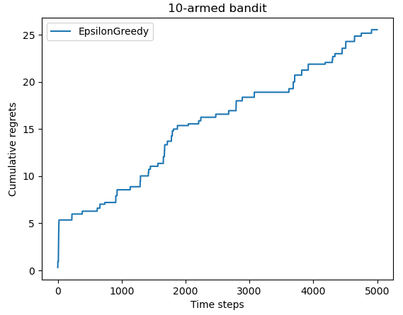

如果我们将第二次设置随机种子的代码删除掉

```python
np.random.seed(1)  # 设定随机种子,使实验具有可重复性
K = 10
bandit_10_arm = BernoulliBandit(K)

epsilon_greedy_solver = EpsilonGreedy(bandit_10_arm, epsilon=0.01)
epsilon_greedy_solver.run(5000)
plot_results([epsilon_greedy_solver], ["EpsilonGreedy"])
```

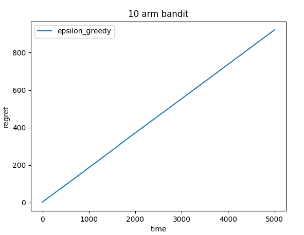

会发现效果非常差，这是因为在选择到最好位置（k=1的arm）的时候，没有获奖的次数很多，从而对期望奖励的估计会很小，导致机器认为最好的arm并不是实际上最好的那个arm

当我们切换seed为0或者2时的效果会很接近书上的效果，对于上面只设置一次seed=1的状况，如果我们加大尝试次数（比如10000），那么我们在随机的过程中也会将这部分错误的认知，修复过来

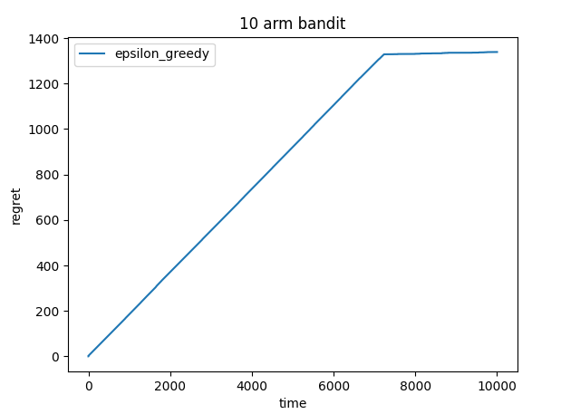

对于尝试不同的ϵ这部分，同样可以证实这点，书中给出的代码如下

```python
np.random.seed(1)  # 设定随机种子,使实验具有可重复性
K = 10
bandit_10_arm = BernoulliBandit(K)

np.random.seed(0)
epsilons = [1e-4, 0.01, 0.1, 0.25, 0.5]
epsilon_greedy_solver_list = [
    EpsilonGreedy(bandit_10_arm, epsilon=e) for e in epsilons
]
for solver in epsilon_greedy_solver_list:
    solver.run(5000)
```

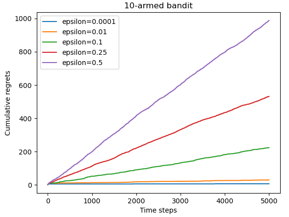

如果我们将第二个设置seed的代码去掉

```python
np.random.seed(1)  # 设定随机种子,使实验具有可重复性
K = 10
bandit_10_arm = BernoulliBandit(K)

epsilons = [1e-4, 0.01, 0.1, 0.25, 0.5]
epsilon_greedy_solver_list = [
    EpsilonGreedy(bandit_10_arm, epsilon=e) for e in epsilons
]
for solver in epsilon_greedy_solver_list:
    solver.run(5000)
```

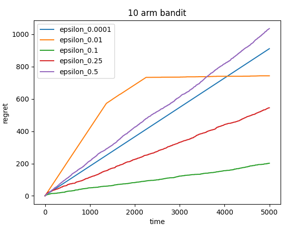

我们会发现ϵ=0.01和ϵ=0.0001时的效果居然比ϵ=0.25和ϵ=0.1时的效果要差，这是因为当ϵ很小时，可以认为他就是一个纯贪心的算法，只有利用而没有探索，并没有很好的平衡这两部分

### 变化ϵ的ϵ-贪心算法

同样的，对于变化ϵ的ϵ-贪心算法，书中的实现方法是

```python
np.random.seed(1)  # 设定随机种子,使实验具有可重复性
K = 10
bandit_10_arm = BernoulliBandit(K)

np.random.seed(1)
decaying_epsilon_greedy_solver = DecayingEpsilonGreedy(bandit_10_arm)
decaying_epsilon_greedy_solver.run(5000)
```

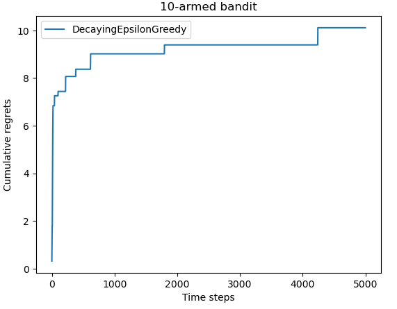

与上面一样，我们删除掉第二个设置随机种子的代码

```python
np.random.seed(1)  # 设定随机种子,使实验具有可重复性
K = 10
bandit_10_arm = BernoulliBandit(K)

decaying_epsilon_greedy_solver = DecayingEpsilonGreedy(bandit_10_arm)
decaying_epsilon_greedy_solver.run(5000)
```

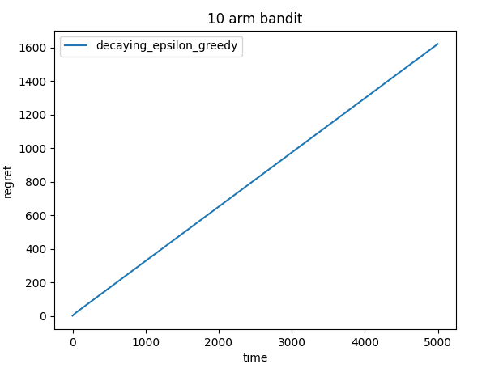

同样的，会发现效果很差，打上断点debug会发现，对于奖励最高和奖励次高的arm，第一次抽奖时，全都没抽中，此时我们对于这两个arm的奖励估计直接变为0了，而在随后的探索过程中，也没有探索到这两个位置，导致最终收敛到一个效果很差的位置

如果我们像上面一样加大尝试次数呢（同样得取10000）？

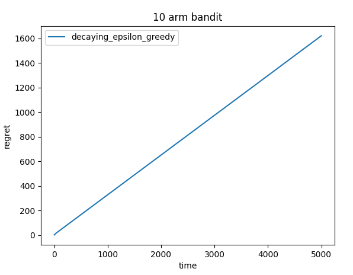

这次并没有像上次那样会改正过来，这是因为随着时间的增加，我们会减少探索，当t（进行次数）>5000时，我们探索的概率为1/t，也就是只有0.0002的概率我们才会探索，也可以说在后面就是纯利用的部分，不会再进行探索，所以错误的结果也不会被改正

不过我们却可以通过修改ϵ的衰减函数来改善，比如$$\epsilon = \frac{1}{{t^{0.8}}}$$

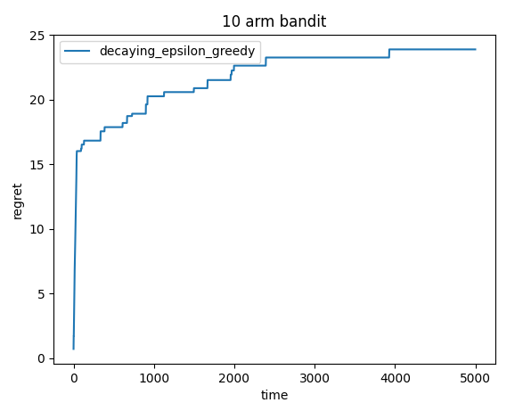

换言之，我们在前期加大探索，充分理解每个arm的奖励期望估计后，在进行利用，就可以避免上面的问题

## 上置信界算法

对于上置信界算法，并不会出现像是ϵ-贪心算法里出现的情况，书中的实现方法是

```python
np.random.seed(1)  # 设定随机种子,使实验具有可重复性
K = 10
bandit_10_arm = BernoulliBandit(K)

np.random.seed(1)
coef = 1  # 控制不确定性比重的系数
UCB_solver = UCB(bandit_10_arm, coef)
UCB_solver.run(5000)
```

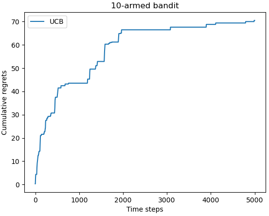

当我们删除掉第二个设置随机种子的代码时

```python
np.random.seed(1)  # 设定随机种子,使实验具有可重复性
K = 10
bandit_10_arm = BernoulliBandit(K)

coef = 1  # 控制不确定性比重的系数
UCB_solver = UCB(bandit_10_arm, coef)
UCB_solver.run(5000)
```

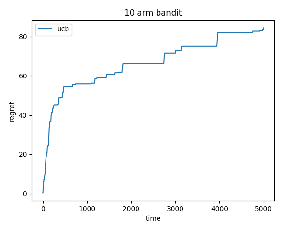

但是，当我们增加尝试次数时，我们的累积懊悔也是在递增的

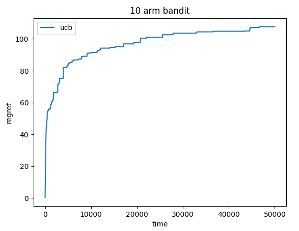

增长速度大概是以$O(\log x)$的速度增长，并不会像变化ϵ的ϵ-贪心算法，最终会收敛到一个位置，不再变动

这是因为我们选取arm的方式公式$$a = \underset{a \in A}{\operatorname{argmax}} \left[ \hat{Q}(a) + \hat{U}(a) \right]$$

其中$$\hat{U}_t(a) = \sqrt{\frac{\log t}{2(N_t(a) + 1)}}$$

这意味着，随着t的增加，如果我们选取a的次数不变的话，我们选取它的权重会变大，这是因为我们置信度$1 - p = 1 - \frac{1}{t}$我们要使置信度随着时间的增加，置信度也要增加

这样有好处有坏处，好处是，不会像变化ϵ的ϵ-贪心算法可能会选择一个错误的最优选择，从而导致累积懊悔线性增加，坏处是累积懊悔是以一个次线性的速度增加

## 汤普森采样算法

对于汤普森采样算法，与上置信界算法相同的是，一样不会出现ϵ-贪心算法里出现的情况，书中的实现方法是

```python
np.random.seed(1)  # 设定随机种子,使实验具有可重复性
K = 10
bandit_10_arm = BernoulliBandit(K)

np.random.seed(1)
thompson_sampling_solver = ThompsonSampling(bandit_10_arm)
thompson_sampling_solver.run(5000)
```

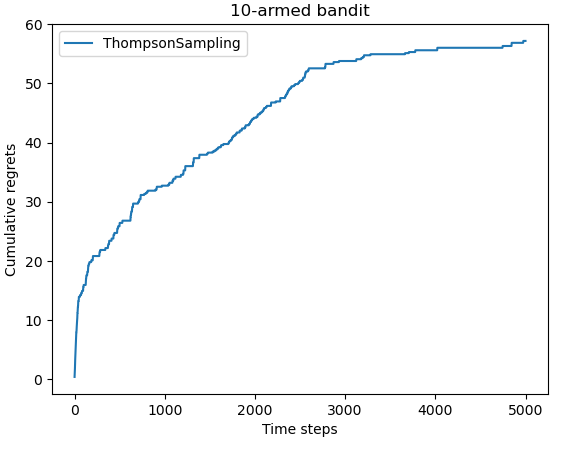

同样地，当我们删除掉第二个设置随机种子的代码时

```python
np.random.seed(1)  # 设定随机种子,使实验具有可重复性
K = 10
bandit_10_arm = BernoulliBandit(K)

np.random.seed(1)
thompson_sampling_solver = ThompsonSampling(bandit_10_arm)
thompson_sampling_solver.run(5000)
```

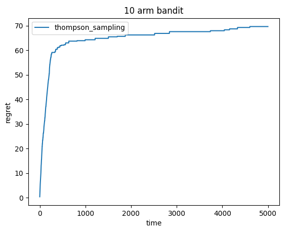

与上置信界算法不同的是，随着尝试次数的增加，虽然理论上与上置信界算法一样，累计懊悔都是$O(\log x)$的速度增长，但是，往往增长的会比上置信界算法慢些

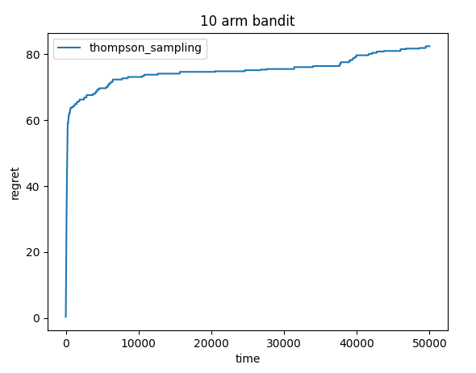

不过这里的好一点，仅仅是在奖励是伯努利分布的情况下，像是在课程中介绍的如果奖励是在整个实数范围内的高斯分布的情况下，上置信界算法往往会比汤普森采样算法好些
